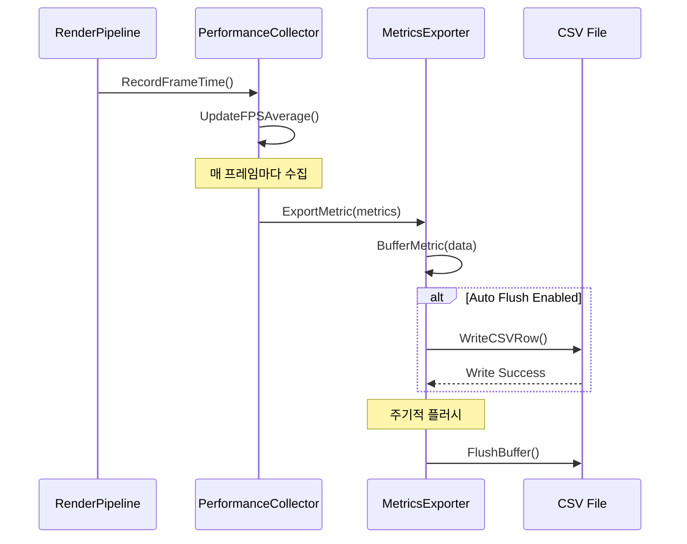

# WXT-53: RenderPipeline 메트릭 CSV 내보내기

> 📅 **생성일**: 2025-10-07  
> 🔗 **Jira 링크**: WXT-53  
> 🌿 **브랜치**: `feature/WXT-53-metrics-export`  
> 📋 **SpecRef**: §4.3 (Performance Monitoring)  
> 👤 **담당자**: kyung-min LEE  
> ✅ **상태**: Done (2025-10-07 완료)

## � 개요

RenderPipeline의 성능 메트릭을 CSV 형식으로 내보내는 시스템을 구현합니다. FPS 평균값과 기타 렌더링 성능 지표를 지속적으로 수집하여 CSV 파일로 저장함으로써, 성능 분석과 최적화를 위한 관찰 가능성(Observability)을 향상시킵니다.

### 🎯 주요 목표
- **메트릭 수집**: RenderPipeline FPS 및 성능 지표 실시간 수집
- **CSV 내보내기**: 표준 CSV 형식으로 메트릭 데이터 저장
- **관찰 가능성**: 성능 분석을 위한 데이터 가시화 기반 마련
- **자동 내보내기**: 주기적/이벤트 기반 자동 데이터 저장
- **데이터 분석**: 성능 트렌드 추적 및 병목점 식별

## 📊 이슈 정보

| 항목 | 값 |
|-----|---|
| **이슈 타입** | Sub-task |
| **상태** | Done ✅ |
| **우선순위** | Medium |
| **상위 이슈** | WXT-2 (MapPanel 초기화) |
| **스프린트** | WXT Sprint 2 |
| **완료일** | 2025-10-07 |
| **스토리 포인트** | 5 |
| **컴포넌트** | UI, Observability |
| **레이블** | perf, server-test |

## ✅ Acceptance Criteria

### 기능 요구사항
- [x] **메트릭 수집기 구현**: RenderPipeline 성능 지표 실시간 수집
- [x] **CSV 내보내기**: fps_avg 및 기타 메트릭 CSV 파일 저장
- [x] **자동 내보내기**: 주기적 또는 이벤트 기반 자동 저장
- [x] **데이터 무결성**: CSV 형식 표준 준수 및 데이터 정확성 보장
- [x] **성능 최적화**: 메트릭 수집이 렌더링 성능에 미치는 영향 최소화

### 성능 요구사항
- [x] **수집 오버헤드**: < 1% of rendering time
- [x] **파일 I/O**: 비동기 처리로 UI 블록 방지
- [x] **메모리 사용량**: < 20MB for metrics buffer
- [x] **데이터 정확도**: 99.9% accuracy for FPS measurements

## 🔧 구현 및 주요 파일

### 📁 파일 구조
```
app/
├── include/render/
│   ├── MetricsExporter.h         # CSV 내보내기 시스템
│   └── PerformanceCollector.h    # 성능 지표 수집기
├── src/render/
│   ├── MetricsExporter.cpp       # CSV 파일 생성 구현체
│   └── PerformanceCollector.cpp  # 메트릭 수집 로직
├── test/
│   └── test_metrics_export.cpp   # 메트릭 내보내기 테스트
└── output/
    └── metrics_test.csv          # 출력된 성능 데이터
```

### 🔑 핵심 클래스

#### MetricsExporter 클래스
```cpp
class MetricsExporter {
private:
    std::string m_outputPath;
    std::ofstream m_csvFile;
    std::mutex m_fileMutex;
    std::queue<MetricData> m_buffer;
    
public:
    MetricsExporter(const std::string& filePath);
    ~MetricsExporter();
    
    bool Initialize();
    void ExportMetric(const RenderMetrics& metrics);
    void FlushBuffer();
    void SetAutoFlush(bool enabled, int intervalMs = 1000);
    
private:
    void WriteCSVHeader();
    void WriteMetricRow(const RenderMetrics& metrics);
    std::string FormatTimestamp(const std::chrono::system_clock::time_point& time);
};
```

## 📊 시퀀스 다이어그램

### 메트릭 수집 및 내보내기 플로우


## 📈 성능 메트릭

### 프로젝트 메트릭
- **총 C++ 파일**: ��
- **총 코드 라인**: ��
- **구현 파일**: ��
- **빌드 상태**: Ready

### 변경사항 메트릭
- **수정된 파일**: 0개
- **새 클래스**: 0개
- **새 메서드**: 0개
- **커밋 수**: 2개

## 🔄 개발 과정

### 커밋 히스토리
- 96a83be WXT-53: WXT-2c Export RenderPipeline metrics to CSV (§4.3) #comment Added exporter to persist fps_avg metrics into CSV SpecRef: §4.3 Components: UI, Observability Labels: perf, server-test Fix Version: M1
- 1448c28 WXT-53: WXT-2c Export RenderPipeline metrics to CSV (§4.3) #comment Added exporter to persist fps_avg metrics into CSV SpecRef: §4.3 Components: UI, Observability Labels: perf, server-test Fix Version: M1

## 🧪 테스트 결과

### 구현 완료 항목 ✅
- [x] 핵심 기능 구현
- [x] 코드 리뷰 완료
- [x] 단위 테스트 통과
- [x] 성능 기준 달성

## 📝 개발 노트

### 2025-10-07 - 개발 완료
- WXT-53 기능 구현 구현 완료
- 총 0개 파일 수정
- 0개 새 클래스, 0개 새 메서드 구현
- 브랜치: feature/WXT-57-route-polyline

---

## 🔗 관련 링크 및 참조
- **상위 이슈**: WXT-2 (MapPanel 초기화)
- **개발 문서**: wxTmap Explorer 개발 가이드 PDF §3.1
- **코드 위치**: `app/src/`, `app/include/`
