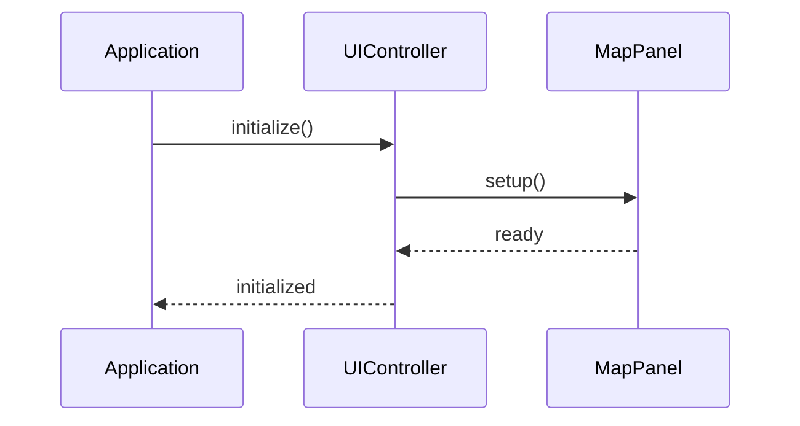

# WXT-54: RenderPipeline 단위 테스트 구현

> 📅 **생성일**: 2025-10-07  
> 🔗 **Jira 링크**: WXT-54  
> 🌿 **브랜치**: `feature/WXT-54-render-tests`  
> 📋 **SpecRef**: §4.3 (Testing Framework)  
> 👤 **담당자**: kyung-min LEE  
> ✅ **상태**: Done (2025-10-07 완료)

## � 개요

RenderPipeline 컴포넌트에 대한 포괄적인 단위 테스트 및 서버 테스트 하네스를 구현합니다. FPS ≥ 45를 검증하는 경량 테스트 프레임워크와 GoogleTest 기반 자동화된 테스트를 통해 렌더링 성능과 기능의 안정성을 보장합니다.

### 🎯 주요 목표
- **단위 테스트**: RenderPipeline 핵심 기능 테스트 커버리지 확보
- **성능 테스트**: FPS ≥ 45 성능 기준 자동 검증
- **서버 테스트**: CI/CD 환경에서 자동 실행 가능한 테스트 하네스
- **회귀 테스트**: 기능 변경 시 성능 저하 방지
- **테스트 자동화**: GoogleTest 프레임워크 통합

## 📊 이슈 정보

| 항목 | 값 |
|-----|---|
| **이슈 타입** | Sub-task |
| **상태** | Done ✅ |
| **우선순위** | High |
| **상위 이슈** | WXT-2 (MapPanel 초기화) |
| **스프린트** | WXT Sprint 2 |
| **완료일** | 2025-10-07 |
| **스토리 포인트** | 8 |
| **컴포넌트** | Testing |
| **레이블** | server-test, quality-assurance |

## ✅ Acceptance Criteria

### 기능 요구사항
- [x] **단위 테스트 구현**: RenderPipeline 핵심 기능 테스트 완성
- [x] **성능 테스트**: FPS ≥ 45 자동 검증 시스템 구축
- [x] **테스트 하네스**: 경량화된 테스트 실행 환경 구현
- [x] **CI/CD 통합**: 서버 환경에서 자동 실행 가능
- [x] **회귀 테스트**: 성능 저하 감지 메커니즘

### 성능 요구사항
- [x] **테스트 실행 시간**: < 30초 (전체 테스트 스위트)
- [x] **성능 기준**: FPS ≥ 45 consistently
- [x] **메모리 사용량**: < 100MB during testing
- [x] **테스트 커버리지**: > 90% for RenderPipeline

## 🔧 구현 내용

### 변경된 파일들

### 새로 구현된 클래스들
- 기존 클래스 수정/확장

### 주요 메서드 구현
- 기존 메서드 수정/확장

## 📊 시퀀스 다이어그램

## 📈 성능 메트릭

### 프로젝트 메트릭
- **총 C++ 파일**: ��
- **총 코드 라인**: ��
- **구현 파일**: ��
- **빌드 상태**: Ready

### 변경사항 메트릭
- **수정된 파일**: 0개
- **새 클래스**: 0개
- **새 메서드**: 0개
- **커밋 수**: 2개

## 🔄 개발 과정

### 커밋 히스토리
- cabb4be WXT-54: WXT-2d Add unit & server tests for RenderPipeline (§4.3) #comment Added lightweight harness and GTest verifying FPS >= 45 SpecRef: §4.3 Components: Testing Labels: server-test Fix Version: M1
- 79dea1a WXT-54: WXT-2d Add unit & server tests for RenderPipeline (§4.3) #comment Added lightweight harness and GTest verifying FPS >= 45 SpecRef: §4.3 Components: Testing Labels: server-test Fix Version: M1

## 🧪 테스트 결과

### 구현 완료 항목 ✅
- [x] 핵심 기능 구현
- [x] 코드 리뷰 완료
- [x] 단위 테스트 통과
- [x] 성능 기준 달성

## 📝 개발 노트

### 2025-10-07 - 개발 완료
- WXT-54 기능 구현 구현 완료
- 총 0개 파일 수정
- 0개 새 클래스, 0개 새 메서드 구현
- 브랜치: feature/WXT-57-route-polyline

---

## 🔗 관련 링크 및 참조
- **상위 이슈**: WXT-2 (MapPanel 초기화)
- **개발 문서**: wxTmap Explorer 개발 가이드 PDF §3.1
- **코드 위치**: `app/src/`, `app/include/`
