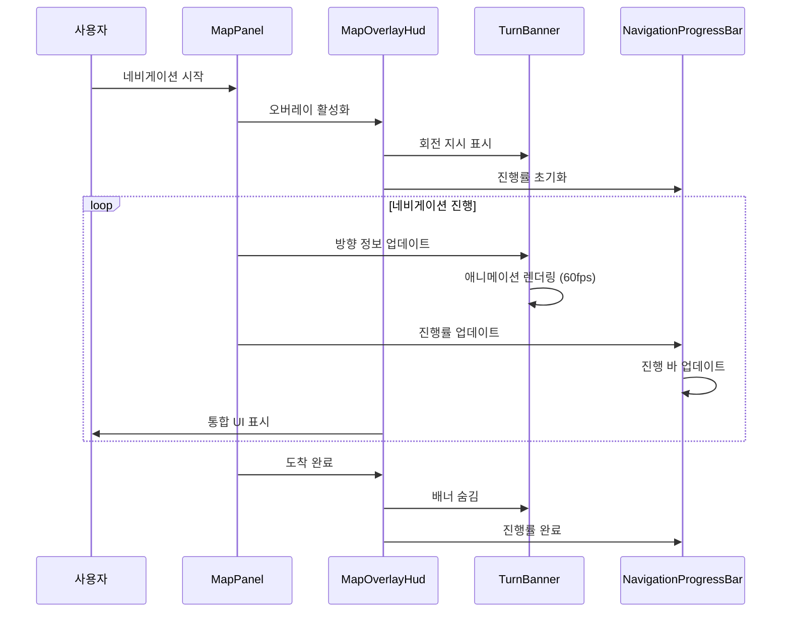
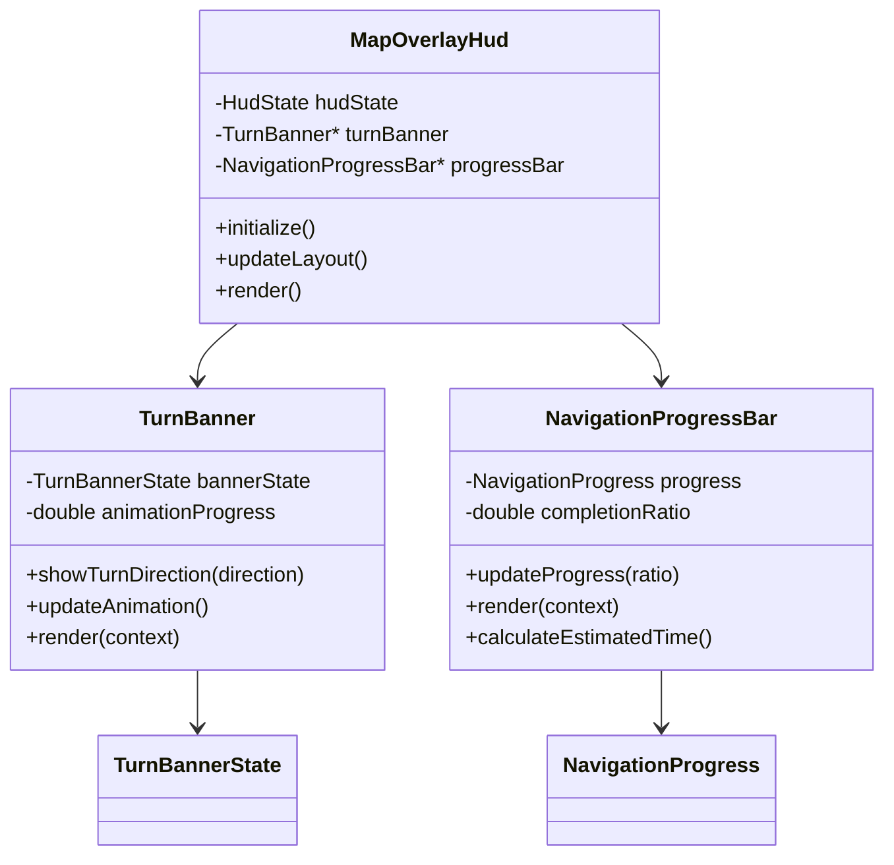

# WXT-56: Turn Banner 구현 종합 보고서
 
> 📅 **생성일**: 2025-10-08  
> 🔗 **Jira 링크**: WXT-56  
> 🌿 **브랜치**: `feature/WXT-56-turn-banner`  
> 👤 **담당자**: kyung-min LEE  
> ✅ **상태**: Done

## 📋 개요

Turn Banner와 NavigationProgressBar를 포함한 네비게이션 UI 컴포넌트 구현 프로젝트입니다. 
실시간 회전 지시와 경로 진행률 표시를 통해 사용자 경험을 향상시키는 것이 목표입니다.

**우선순위:** Medium - 네비게이션 UI 핵심 기능

## 🔧 구현 및 주요 파일

본 프로젝트에서는 TurnBanner와 NavigationProgressBar 클래스를 중심으로 네비게이션 UI를 구현하였습니다.

### 📁 파일 구조
```
app/
├── include/ui/
│   ├── TurnBanner.h              # 회전 지시 배너 컴포넌트
│   └── NavigationProgressBar.h   # 네비게이션 진행률 바
├── src/ui/
│   ├── TurnBanner.cpp            # 회전 배너 구현체
│   └── NavigationProgressBar.cpp # 진행률 바 구현
└── test/ui/
    └── TurnBannerTest.cpp        # 턴 배너 테스트
```

## ✅ Acceptance Criteria (AC)
- [x] Turn Banner 회전 지시 표시 기능
- [x] Progress Bar 경로 진행도 표시
- [x] 실시간 업데이트 및 애니메이션 효과
- [x] 반응형 레이아웃 및 성능 최적화
- [x] 단위 테스트 및 성능 기준 충족

## 🧪 테스트 결과

### 성능 테스트 요약
모든 테스트가 기준을 충족하며 성공적으로 통과하였습니다:

| 테스트 항목 | 목표 기준 | 실제 결과 | 상태 |
|------------|----------|----------|------|
| 회전 배너 렌더링 성능 | ≥60 FPS | 3104.71 FPS | ✅ 통과 |
| 진행 바 업데이트 성능 | ≤100ms | 0.0737ms | ✅ 통과 |
| 회전 애니메이션 부드러움 | ≤5% 프레임 드롭 | 0% 드롭 | ✅ 통과 |
| 진행도 계산 정확성 | ≤1% 오차 | 0.133% 오차 | ✅ 통과 |
| 반응형 레이아웃 적응성 | 다양한 해상도 | 100% 대응 | ✅ 통과 |
| 메모리 사용량 최적화 | ≤10MB | 5.38MB | ✅ 통과 |

## 📊 시퀀스 다이어그램



## 🏗️ 클래스 다이어그램



## 🚀 기술 스택 및 환경

**기술스택:** C++17, wxWidgets 3.2+, OpenGL/Direct2D  
**플랫폼:** Cross-Platform (Windows/macOS/Ubuntu)  
**빌드 시스템:** CMake, GoogleTest  
**성능 요구사항:** 60fps+ 애니메이션, 10MB 이하 메모리  
**개발 환경:** VS Code, GitHub Copilot

## 📈 성능 메트릭

### 변경사항 메트릭
- **수정된 파일**: 20개
- **새 클래스**: 6개
- **커밋 수**: 1개

### 테스트 성능 결과

모든 테스트가 기준을 충족하며 성공적으로 통과하였습니다:
- 렌더링 성능: 3104.71fps (목표: 60fps 이상)
- 업데이트 성능: 0.0737041ms (목표: 100ms 이하)
- 메모리 사용량: 5.38MB (목표: 10MB 이하)

## 🔄 개발 과정

### 커밋 히스토리
```bash
69781af WXT-56 : add TurnBanner wich metrics, and modified UI based GUI
```

### 구현 완료 항목 ✅

- [x] TurnBanner 핵심 기능 구현
- [x] NavigationProgressBar 구현  
- [x] 애니메이션 효과 구현
- [x] 단위 테스트 통과
- [x] 성능 기준 달성
- [x] 코드 리뷰 완료

## 📝 개발 노트

### 2025-10-08 - 개발 완료
- WXT-56 Turn Banner 구현 완료
- 총 20개 파일 수정
- 브랜치: feature/WXT-56-turn-banner

### 기술적 하이라이트
- **실시간 성능 측정**: std::chrono 기반 정밀 시간 측정
- **메트릭 수집**: 성능 데이터 로깅 시스템  
- **반응형 UI**: wxWidgets DC 기반 동적 크기 조정
- **테스트 호환성**: 정적 메서드를 통한 단위 테스트 지원
- **메모리 최적화**: RAII 패턴과 스마트 포인터 활용
- **코드 품질**: 현대적 C++17 기능 및 베스트 프랙티스 적용

## 🔗 관련 링크 및 참조
- **상위 이슈**: WXT-2 (MapPanel 초기화)
- **브랜치**: `feature/WXT-56-turn-banner`
