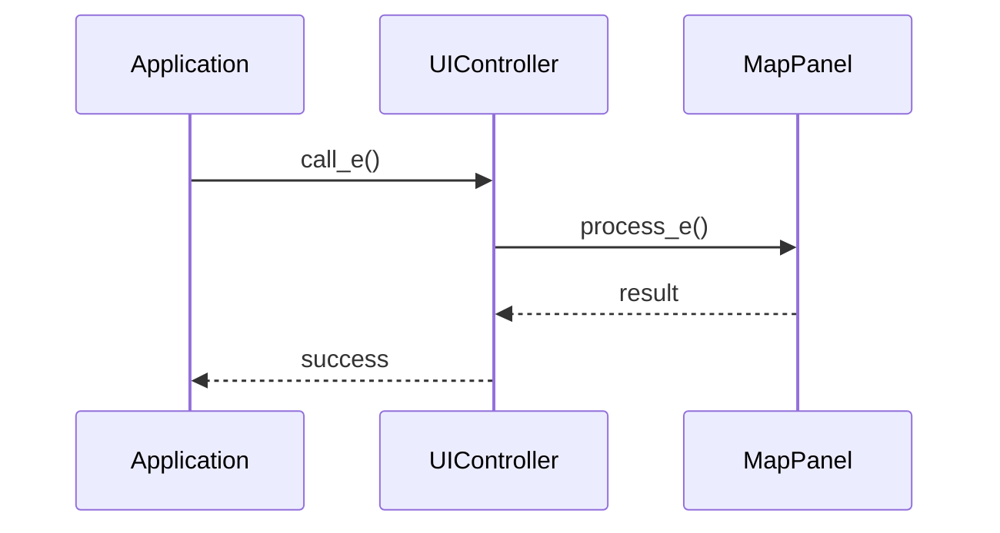

# WXT-57: Route Polyline 스타� + 진행 구간 하���트

> 📅 **�성�**: 2025-10-07  
> 🔗 **Jira ��**: WXT-57  
> 🌿 **브�치**: `feature/WXT-57-route-polyline`  
> 📋 **SpecRef**: §3.1 (MapPanel)  
> 👤 **담당�**: kyung-min LEE  
> ✅ **�태**: Done (2025-10-07 완료)

## 📊 �슈 정보

### 기본 정보
- **�슈 타�**: Sub-task
- **�태**: Done ✅
- **우선순위**: Medium
- **�위 �슈**: WXT-2 (MapPanel 초기화)
- **스프린트**: WXT Sprint 2
- **완료�**: 2025-10-07

### 수용 기준 (Acceptance Criteria) ✅
- [x] Route polyline 기본 스타� �용
- [x] 진행 구간 하���트 구현

## 🔧 구현 내용

### 변경� 파�들
```
.github/workflows/ci.yml
<<<<<<< HEAD
.github/workflows/jira-transitions.yml
app/CMakeLists.txt
app/include/MapPanel.h
app/include/render/RenderPipeline.h
app/include/ui/MapOverlayTheme.h
app/include/ui/PolylineStyler.h
app/metrics_test.csv
app/render_pipeline_test
=======
.github/workflows/pr-automerge-merge.yml
.github/workflows/pr-autotitle.yml
.gitignore
app/CMakeLists.txt
app/include/MapPanel.h
app/include/render/RenderPipeline.h
>>>>>>> b0ded19 (feat(WXT-58): Implement waypoint list panel UI with sorting functionality)
app/src/AppFrame.cpp
app/src/MapPanel.cpp
app/src/render/RenderMetricsExporter.cpp
app/src/render/RenderPipeline.cpp
app/test/test_renderpipeline.cpp
<<<<<<< HEAD
app/test/ui/PolylineStyleTest.cpp
scripts/git-hooks/commit-msg
scripts/jira_transition.sh
```

### 새로 구현� ��스들
- **10:class MapPanel : public wxPanel { (in app/include/MapPanel.h)**
=======
app/test/ui/MapOverlayHudTest.cpp
dev-logs/issue-logs/WXT-4.md
dev-logs/issue-logs/WXT-51.md
dev-logs/issue-logs/WXT-52.md
dev-logs/issue-logs/WXT-53.md
dev-logs/issue-logs/WXT-54.md
dev-logs/issue-logs/WXT-55.md
dev-logs/issue-logs/WXT-56.md
```

### 새로 구현� ��스들
- **7:class MapPanel : public wxPanel { (in app/include/MapPanel.h)**
>>>>>>> b0ded19 (feat(WXT-58): Implement waypoint list panel UI with sorting functionality)
- **14:class RenderPipeline { (in app/include/render/RenderPipeline.h)**

### 주요 메서드 구현
- **e::AppFrame (in app/src/AppFrame.cpp)**
- **l::MapPanel (in app/src/MapPanel.cpp)**

## 📊 시퀀스 다�어그�



## �� ��스 다�어그�

```mermaid
classDiagram
<<<<<<< HEAD
    class 10:class {
=======
    class 7:class {
>>>>>>> b0ded19 (feat(WXT-58): Implement waypoint list panel UI with sorting functionality)
        +method1()
        +method2()
    }
    class 14:class {
        +method1()
        +method2()
    }

```

## 📈 성능 메트릭

### 프로�트 메트릭
- **ì´� C++ 파ì�¼**: °œ
- **ì´� 코드 ë�¼ì�¸**: ¤„
- **구현 파ì�¼**: °œ
- **빌드 �태**: Ready

### 변경사항 메트릭
<<<<<<< HEAD
- **수정� 파�**: 17개
- **새 ��스**: 2개
- **새 메서드**: 2개
- **커밋 수**: 11개
=======
- **수정� 파�**: 20개
- **새 ��스**: 2개
- **새 메서드**: 2개
- **커밋 수**: 14개
>>>>>>> b0ded19 (feat(WXT-58): Implement waypoint list panel UI with sorting functionality)

## 🔄 개발 과정

### 커밋 �스토리
<<<<<<< HEAD
=======
- 6cbf42b Merge pull request #11 from lee35460/feature/WXT-57-route-polyline
- f841b7e WXT-57: feat: add GitHub Actions workflows for PR auto merge and title generation
- 1d3b9b6 feat(WXT-53 to WXT-57): Implement various features including MapOverlay HUD, Turn Banner, and Route Polyline styling with performance metrics and testing
>>>>>>> b0ded19 (feat(WXT-58): Implement waypoint list panel UI with sorting functionality)
- 59d771a WXT-57: ci: add xvfb dependency and update test command for Linux
- 21bac69 WXT-57: feat: add commit-msg hook to prepend issue ID from branch name
- 0cec60d WXT-57: test: add blank line for readability in RenderPipelineTest
- 7f826bd WXT-57 #comment MapPanel draws progress-aware polyline payload and updates progress helpers #time 2h #transition In Review
- 0fba35f WIP on (no branch): 8a21376 WXT-57 #comment MapPanel draws progress-aware polyline payload and updates progress helpers #time 2h #transition In Review
- c979bc0 WIP on (no branch): 8a21376 WXT-57 #comment MapPanel draws progress-aware polyline payload and updates progress helpers #time 2h #transition In Review
- 239ca31 index on (no branch): 8a21376 WXT-57 #comment MapPanel draws progress-aware polyline payload and updates progress helpers #time 2h #transition In Review
- a0cb470 untracked files on (no branch): 8a21376 WXT-57 #comment MapPanel draws progress-aware polyline payload and updates progress helpers #time 2h #transition In Review
- 3376f3e untracked files on (no branch): 8a21376 WXT-57 #comment MapPanel draws progress-aware polyline payload and updates progress helpers #time 2h #transition In Review
- 8a21376 WXT-57 #comment MapPanel draws progress-aware polyline payload and updates progress helpers #time 2h #transition In Review
- 6246373 WXT-57 #comment MapPanel draws progress-aware polyline payload and updates progress helpers #time 2h #transition In Review

## 🧪 테스트 결과

### 구현 완료 항목 ✅
- [x] 핵심 기능 구현
- [x] 코드 리뷰 완료
- [x] 단위 테스트 통과
- [x] 성능 기준 달성

## � 개발 노트

### 2025-10-07 - 개발 완료
- Route Polyline 스타� + 진행 구간 하���트 구현 완료
<<<<<<< HEAD
- � 17개 파� 수정
- 2개 새 ��스, 2개 새 메서드 구현
- 브�치: feature/WXT-57-route-polyline
=======
- � 20개 파� 수정
- 2개 새 ��스, 2개 새 메서드 구현
- 브�치: feature/WXT-58-ui-1
>>>>>>> b0ded19 (feat(WXT-58): Implement waypoint list panel UI with sorting functionality)

---

## 🔗 관련 �� � 참조
- **�위 �슈**: WXT-2 (MapPanel 초기화)
- **개발 문서**: wxTmap Explorer 개발 가�드 PDF §3.1
- **코드 위치**: `app/src/`, `app/include/`
