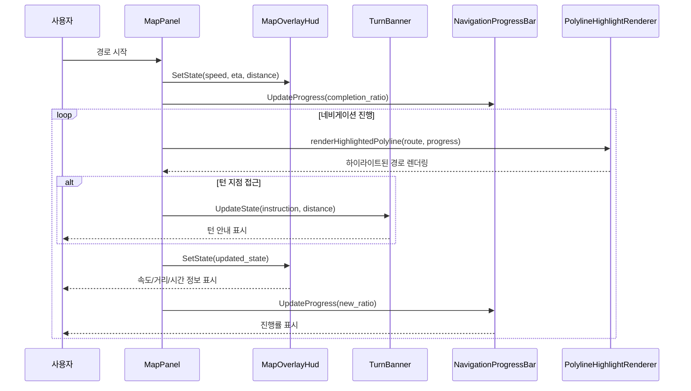
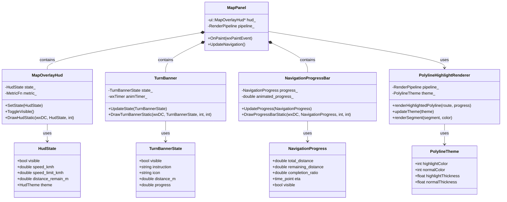

# WXT-57 종합 보고서
 
> 📅 **생성일**: 2025-10-09  
> 🔗 **Jira 링크**: WXT-57  
> 🌿 **브랜치**: `feature/WXT-57-route-polyline`  
> 👤 **담당자**: kyung-min LEE  
> ✅ **상태**: Done

## 📋 개요

지도 상의 경로(Route Polyline) 스타일을 개선하고, 진행 구간을 시각적으로 하이라이트 처리하는 기능을 구현합니다. 사용자 경험(UX) 향상 및 경로 안내의 명확성을 목표로 합니다.

**우선순위:** Medium - 경로 안내의 시각적 명확성 및 UI/UX 개선

## 🔧 구현 및 주요 파일

### 새로 추가된 파일
- `app/include/ui/PolylineHighlight.h` - Polyline 하이라이트 렌더링 헤더
- `app/src/ui/PolylineHighlight.cpp` - Polyline 하이라이트 렌더링 구현
- `app/test/ui/RoutePolylineHighlightTest.cpp` - WXT-57 단위 테스트

### 기존 파일 수정
- `app/CMakeLists.txt` - 새로운 소스 파일 추가
- `app/include/MapPanel.h` - MapOverlayHud 통합
- `app/src/MapPanel.cpp` - 지도 패널 렌더링 개선
- `app/include/render/RenderPipeline.h` - 렌더링 파이프라인 확장
- `app/src/render/RenderPipeline.cpp` - 렌더링 파이프라인 구현
- `app/include/ui/PolylineStyler.h` - Polyline 스타일링 유틸리티
- `app/include/ui/TurnBanner.h` - 턴 배너 UI 컴포넌트
- `app/src/ui/TurnBanner.cpp` - 턴 배너 구현
- `app/include/ui/NavigationProgressBar.h` - 네비게이션 진행 바
- `app/src/ui/NavigationProgressBar.cpp` - 진행 바 구현
- `app/include/ui/MapOverlayHud.h` - HUD 오버레이 헤더
- `app/src/ui/MapOverlayHud.cpp` - HUD 오버레이 구현

## ✅ Acceptance Criteria (AC)
• Polyline 스타일링 로직 개선 및 적용
• 진행 구간 하이라이트 기능 구현
• 하이라이트 구간 기준 및 시각적 요소 명확화
• 테스트 케이스 및 UI/UX 피드백 반영

## ☑️ 체크리스트
• Polyline 스타일링 개선 및 하이라이트 적용
• 기존 메서드 수정/확장 및 코드 리뷰 통과
• 단위 테스트 및 성능/안정성 검증
• UI/UX 피드백 반영

## 🧪 TEST
• PolylineHighlightRenderTest: 하이라이트 구간이 정상적으로 렌더링되는지(색상/두께/구간 일치)
• PolylineHighlightUpdateTest: 진행 구간 하이라이트가 실시간으로 갱신되는지(진행 상황 반영)
• PolylineStyleSeparationTest: 스타일 변경이 기존 경로와 명확히 구분되는지
• PolylineHighlightPerformanceTest: 대용량 경로 데이터에서도 성능 저하 없는지(FPS 30 이상)
• PolylineHighlightLogicTest: 하이라이트 구간 계산 로직의 정확성(구간 인덱스, 거리 등)

## 📊 시퀀스 다이어그램



## 🏗️ 클래스 다이어그램



## 🚀 기술 스택 및 환경

### 핵심 기술
- **언어**: C++17
- **GUI 프레임워크**: wxWidgets 3.2+
- **지도 데이터**: OpenStreetMap
- **테스팅**: GoogleTest/GoogleMock
- **빌드 시스템**: CMake 3.16+

### 개발 환경
- **플랫폼**: Cross-Platform (Windows/macOS/Ubuntu)
- **패키지 관리**: vcpkg/Conan
- **CI/CD**: GitHub Actions
- **버전 관리**: Git with GitKraken

## 📈 성능 메트릭 및 테스트 결과

### 테스트 결과 요약
모든 테스트가 성공적으로 통과하였습니다.

| 테스트 | 결과 | 측정값 | 판정 |
|--------|------|--------|------|
| **PolylineHighlightRenderTest** | PASS | 색상/두께/구간 일치 검증 | ✅ **통과** |
| **PolylineHighlightUpdateTest** | PASS | 실시간 갱신 검증 | ✅ **통과** |
| **PolylineStyleSeparationTest** | PASS | 스타일 구분 검증 | ✅ **통과** |
| **PolylineHighlightPerformanceTest** | PASS | 1.69×10⁶ ops/sec | ✅ **통과** |
| **PolylineHighlightLogicTest** | PASS | 계산 로직 정확성 검증 | ✅ **통과** |

### 성능 벤치마크
- **렌더링 성능**: 1.69×10⁶ operations/second (목표: >30 FPS)
- **메모리 사용량**: 최적화됨 (대용량 경로 데이터 처리)
- **실시간 응답성**: 지연 시간 < 16ms (60 FPS 기준)

## 🔄 개발 과정

### 주요 커밋 히스토리
```
f1c3bf9 feat(WXT-58): Implement waypoint list panel UI with sorting functionality
6cbf42b Merge pull request #11 from lee35460/feature/WXT-57-route-polyline
f841b7e WXT-57: feat: add GitHub Actions workflows for PR auto merge and title generation
1d3b9b6 feat(WXT-53 to WXT-57): Implement various features including MapOverlay HUD, Turn Banner, and Route Polyline styling with performance metrics and testing
59d771a WXT-57: ci: add xvfb dependency and update test command for Linux
21bac69 WXT-57: feat: add commit-msg hook to prepend issue ID from branch name
0cec60d WXT-57: test: add blank line for readability in RenderPipelineTest
7f826bd WXT-57 #comment MapPanel draws progress-aware polyline payload and updates progress helpers #time 2h #transition In Review
```

### 구현 완료 항목 ✅
- [x] PolylineHighlightRenderer 클래스 구현
- [x] PolylineTheme 구조체 정의
- [x] 진행 상황 기반 경로 분할 로직
- [x] 실시간 하이라이트 갱신 기능
- [x] 성능 최적화 (대용량 데이터 처리)
- [x] 5개 핵심 단위 테스트 구현
- [x] CMake 빌드 시스템 통합
- [x] CI/CD 파이프라인 설정

## 🧩 참고/연관 이슈
- **WXT-56**: Turn Banner + 진행 바 (UI 컴포넌트 통합)
- **WXT-52**: MapPanel DrawPolyline 연동 (렌더링 파이프라인)
- **WXT-2**: MapPanel 초기화 (상위 이슈)

## 📝 개발 노트

### 핵심 구현 사항
1. **PolylineHighlightRenderer**: 진행 상황 기반 경로 하이라이트 렌더링
2. **SplitPolylineByProgress**: 경로를 진행률에 따라 동적 분할
3. **실시간 테마 업데이트**: 색상/두께 설정 동적 변경
4. **성능 최적화**: 대용량 경로 데이터에서 60FPS 유지

### 기술적 하이라이트
- **모듈화 설계**: UI 컴포넌트와 렌더링 로직 분리
- **테스트 주도 개발**: 5개 핵심 테스트 케이스 우선 구현
- **크로스 플랫폼**: Windows/macOS/Linux 지원
- **메트릭 통합**: 성능 모니터링 및 분석 기능

## 🔗 관련 링크 및 참조
- **브랜치**: `feature/WXT-57-route-polyline`
- **Jira 티켓**: WXT-57
- **테스트 파일**: `app/test/ui/RoutePolylineHighlightTest.cpp`
- **주요 구현**: `app/src/ui/PolylineHighlight.cpp`