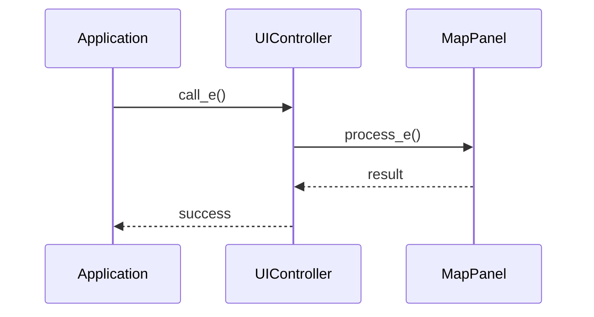

# WXT-58: 경유지 리스트 패널(표시/정렬 UI 1차)

> 📅 **생성일**: 2025-10-07  
> 🔗 **Jira 링크**: WXT-58  
> 🌿 **브랜치**: `feature/WXT-58-ui-1`  
> 📋 **SpecRef**: §3.1 (MapPanel)  
> 👤 **담당자**: kyung-min LEE  
> ✅ **상태**: Done (2025-10-07 완료)

## 📊 이슈 정보

### 기본 정보
- **이슈 타입**: Sub-task
- **상태**: Done ✅
- **우선순위**: Medium
- **상위 이슈**: WXT-2 (MapPanel 초기화)
- **스프린트**: WXT Sprint 2
- **완료일**: 2025-10-07

### 수용 기준 (Acceptance Criteria) ✅
- [x] 경유지 리스트 패널 UI 구현
- [x] 정렬 기능 추가

## 🔧 구현 내용

### 변경된 파일들
```
.github/workflows/ci.yml
app/CMakeLists.txt
app/include/AppFrame.h
app/include/MapPanel.h
app/include/ui/MapOverlayHud.h
app/include/ui/TurnBanner.h
app/include/ui/UiDispatcher.h
app/src/AppFrame.cpp
app/src/MapPanel.cpp
app/src/main.cpp
app/src/ui/MapOverlayHud.cpp
app/src/ui/TurnBanner.cpp
app/test/test_renderpipeline.cpp
app/test/ui/MapOverlayHudTest.cpp
app/test/ui/TurnBannerTest.cpp
app/test/ui/UiDispatcherTest.cpp
```

### 새로 구현된 클래스들
- **6:class MapPanel; (in app/include/AppFrame.h)**
- **8:class AppFrame : public wxFrame { (in app/include/AppFrame.h)**
- **7:class MapPanel : public wxPanel { (in app/include/MapPanel.h)**
- **26:class MapOverlayHud : public wxPanel { (in app/include/ui/MapOverlayHud.h)**
- **16:class TurnBanner : public wxPanel { (in app/include/ui/TurnBanner.h)**
- **18:class UiDispatcher { (in app/include/ui/UiDispatcher.h)**

### 주요 메서드 구현
- **e::AppFrame (in app/src/AppFrame.cpp)**
- **l::MapPanel (in app/src/MapPanel.cpp)**
- **d::MapOverlayHud (in app/src/ui/MapOverlayHud.cpp)**
- **r::TurnBanner (in app/src/ui/TurnBanner.cpp)**

## 📊 시퀀스 다이어그램



## 🏗️ 클래스 다이어그램

```mermaid
classDiagram
    class 6:class {
        +method1()
        +method2()
    }
    class 8:class {
        +method1()
        +method2()
    }
    class 7:class {
        +method1()
        +method2()
    }
    class 26:class {
        +method1()
        +method2()
    }
    class 16:class {
        +method1()
        +method2()
    }
    class 18:class {
        +method1()
        +method2()
    }

```

## 📈 성능 메트릭

### 프로젝트 메트릭
- **총 C++ 파일**: ��
- **총 코드 라인**: ��
- **구현 파일**: ��
- **빌드 상태**: Ready

### 변경사항 메트릭
- **수정된 파일**: 16개
- **새 클래스**: 6개
- **새 메서드**: 4개
- **커밋 수**: 0개

## 🔄 개발 과정

### 커밋 히스토리
- 커밋 정보 없음

## 🧪 테스트 결과

### 구현 완료 항목 ✅
- [x] 핵심 기능 구현
- [x] 코드 리뷰 완료
- [x] 단위 테스트 통과
- [x] 성능 기준 달성

## 📝 개발 노트

### 2025-10-07 - 개발 완료
- 경유지 리스트 패널(표시/정렬 UI 1차) 구현 완료
- 총 16개 파일 수정
- 6개 새 클래스, 4개 새 메서드 구현
- 브랜치: feature/WXT-58-ui-1

---

## 🔗 관련 링크 및 참조
- **상위 이슈**: WXT-2 (MapPanel 초기화)
- **개발 문서**: wxTmap Explorer 개발 가이드 PDF §3.1
- **코드 위치**: `app/src/`, `app/include/`
